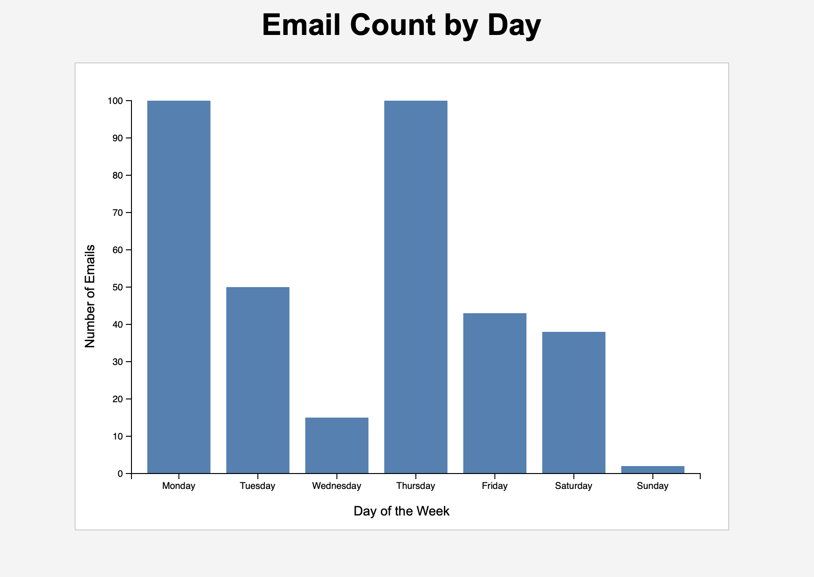

# D3 Homework 1

This project is a basic bar chart visualization created using data loaded from the emails.csv.

## Visualization

The chart displays email counts by day using:
- D3 scales
- Axes
- External CSV data
- SVG elements

## Files

- `index.html` → main webpage
- `main.js` → D3 visualization logic
- `style.css` → styling
- `emails.csv` → dataset

## Author

Tak Do

